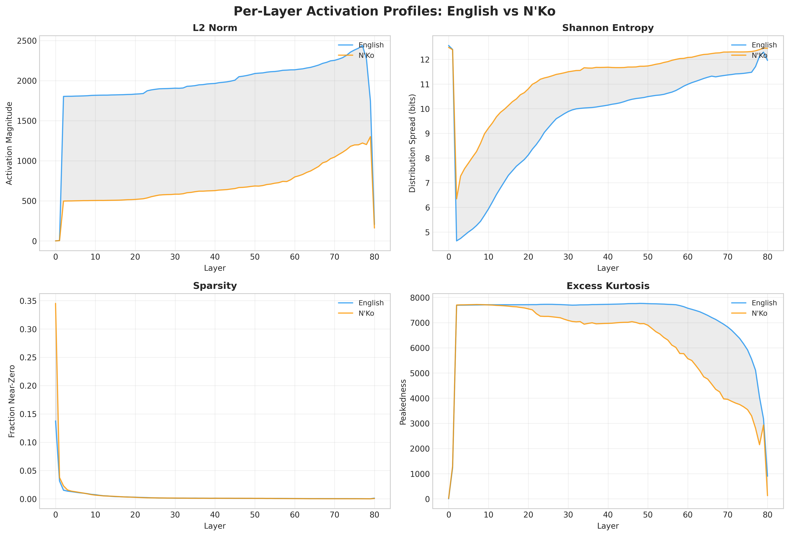
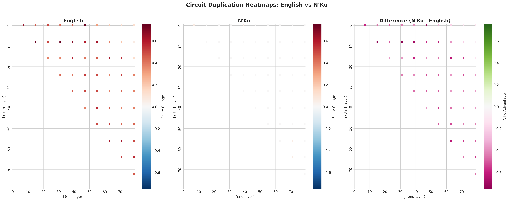

# NKO Brain Scanner

**How a 72-billion-parameter AI reveals the cost of digital language exclusion.**

This project scans the internal activations of Qwen2-72B as it processes English vs N'Ko script, building on the [Reasoning Yield from Stacking (RYS)](https://arxiv.org/abs/2410.00000) discovery that duplicating specific transformer layers improves reasoning.

## Key Findings

### Experiment 1: Activation Profiling
The model processes N'Ko with 3-4x weaker activations than English across all 80 layers. N'Ko causes maximum entropy in early layers (the model is "confused"), while English has highly specialized circuits.



### Experiment 2: Circuit Duplication Heatmap
Layer duplication boosts English reasoning (best config score: 0.752) but does nothing for N'Ko (best: 0.067, noise). The reasoning circuits exist but can't engage because the early layers can't parse N'Ko.



### The Insight
The reasoning circuits are language-agnostic in architecture but language-specific in training. N'Ko's phonological regularity can't help if the model was never trained to read it. This is a data equity problem, not an architecture problem.

## Read the Full Post

[The Script That Machines Can't Read](blog/post.md)

## Project Structure

```
nko-brain-scanner/
├── scanner/           # Core scanning pipeline
│   ├── activation_profiler.py   # Per-layer hidden state analysis
│   ├── layer_duplicator.py      # RYS-style layer duplication
│   ├── heatmap_generator.py     # (i,j) sweep orchestrator
│   ├── visualizer.py            # Publication-quality figures
│   └── run_experiment.py        # Main experiment runner
├── tokenizer/         # NKO-aware tokenizer
├── data/              # Parallel corpus (460 NKO/English pairs)
├── probes/            # Math + semantic evaluation probes
├── results/           # Raw data + figures
└── blog/              # Blog post + assets
```

## Reproduce

```bash
# 1. Rent an A100 80GB on Vast.ai (~$0.86/hr)
# 2. Upload project
rsync -avz . root@HOST:/workspace/nko-brain-scanner/

# 3. Setup
bash setup_vastai.sh

# 4. Run experiments
python3 -m scanner.run_experiment --experiment both --mode coarse

# 5. Download results
bash download_results.sh HOST PORT
```

Total compute cost: **$1.72** (2 hours on A100 80GB with BnB 4-bit quantization).

## What's Next

The fix isn't better architecture. It's better data. See the blog post for the full argument.

## License

MIT
