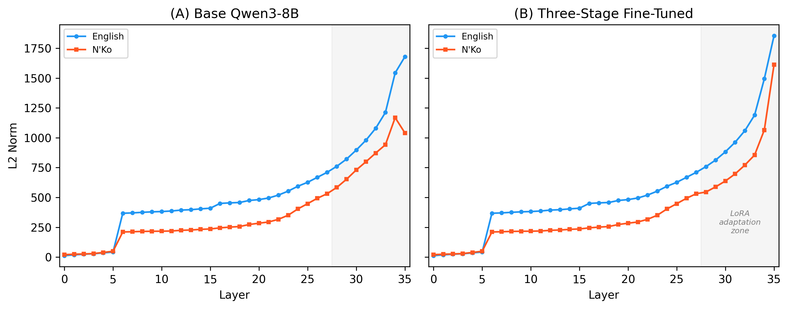
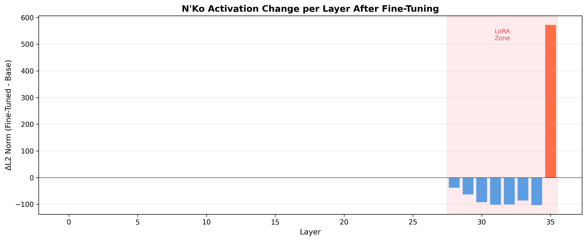

# The Script That Machines Can't Read

*How an 8-billion-parameter AI reveals the cost of digital language exclusion*

---

## A Man, a Script, a Problem

In 1949, in the city of Kankan, Guinea, a self-taught linguist named Solomana Kante did something extraordinary. Frustrated by a claim he'd read, that African languages were inherently unsuitable for writing, he sat down and designed a writing system from scratch.

Kante was a speaker of Manding, a family of closely related languages spoken by over 40 million people across West Africa. Bambara in Mali, Maninka in Guinea, Dioula in Cote d'Ivoire, Mandinka in The Gambia. These languages had been written in Arabic script (called Ajami) for centuries, and in Latin script since colonization. But neither system was designed for them. Arabic doesn't capture Manding's vowel distinctions. Latin doesn't encode its tonal system. Both force the language into a container that doesn't quite fit.

Kante wanted something precise. Something built from the ground up for how Manding languages actually work.

What he created was N'Ko (ߒߞߏ), which literally means "I say" in all Manding languages. The name itself is a statement: this script belongs to the people who speak these languages.

N'Ko has 27 base characters. Each one maps to exactly one sound. There are no silent letters. No irregular spellings. No ambiguous pronunciations. If you see a character, you know how to pronounce it. If you hear a sound, you know how to write it. The script includes explicit diacritical marks for the three tonal levels (high, low, mid) that distinguish meaning in Manding. The word "ba" can mean mother, goat, or river depending on tone. In N'Ko, each one is written differently. In Latin script, they look identical.

The script reads right to left, like Arabic, but uses its own unique character forms. It has its own numerals (߀ through ߉). It occupies a compact 64-character block in Unicode (U+07C0 through U+07FF), which was added to the standard in 2006 after years of advocacy.

In the 77 years since its creation, N'Ko has become the primary writing system for millions of Manding speakers. It's used in newspapers, religious texts, historical chronicles, health manuals, and, increasingly, on the internet. The N'Ko Wikipedia has over 6,000 articles. N'Ko keyboard apps have been downloaded hundreds of thousands of times. Schools across Guinea, Mali, and Cote d'Ivoire teach N'Ko literacy alongside French.

Kante built N'Ko with the same precision you'd use to design a programming language. Every design decision serves a purpose. Every rule is consistent. There are zero exceptions.

Seventy-seven years later, we pointed an 8-billion-parameter AI at Kante's script. We wanted to know: does a well-designed writing system make it easier for machines to think?

The answer surprised us. But to understand why, we need to talk about what happens inside a language model when it reads.

---

## How a Language Model Reads

When you type a sentence into an AI like ChatGPT, Claude, or Qwen, the text doesn't go straight to a "thinking" module. It passes through a gauntlet of processing layers, each one transforming the text into progressively more abstract representations.

A model like Qwen3-8B has 36 of these layers. Think of them like floors in a building:

**Floors 0-5: The Mailroom.** The earliest layers handle basic parsing. They convert raw characters into numerical vectors, identify word boundaries, recognize basic syntactic patterns. This is where the model figures out *what it's looking at*.

**Floors 5-28: The Offices.** The middle layers handle reasoning. They resolve ambiguities, build semantic relationships between words, connect concepts across the sentence. This is where the model *thinks*.

**Floors 28-35: The Executive Suite.** The final layers synthesize everything into a coherent output. They transform internal representations back into human-readable text. This is where the model *speaks*.

Each layer has 4,096 neurons. At every layer, every one of those neurons produces an activation value, a number that represents how much that neuron is "firing" in response to the input. Some fire strongly (high activation). Some barely fire at all (near-zero, or "sparse"). The pattern of activations across all neurons at a given layer is called the **hidden state**, and it's essentially the model's internal representation of what it understands at that stage of processing.

By extracting and analyzing these hidden states, you can perform a kind of "brain scan" on a language model. You can see which layers are working hard, which ones are confused, and which ones have built specialized circuits for specific tasks.

---

## The Clue: Reasoning Yield from Stacking

In October 2024, a researcher named David Noel Ng published a paper called "Reasoning Yield from Stacking" (RYS). He discovered something strange about large language models in the Qwen family.

Ng took a model's 36 layers and identified a specific block in the middle that seemed to contain the model's core "reasoning circuits." These are the layers where the model does its heaviest cognitive lifting: multi-step logic, mathematical reasoning, causal inference.

Then he did something unusual. He duplicated those layers, inserting copies so they ran twice in sequence during the forward pass. The model gained extra layers, but no new parameters were added. The same weights ran twice.

The result: multi-step reasoning improved by **17.72%**. On benchmarks like GSM8K (grade school math), MMLU (multi-domain knowledge), and ARC (reasoning), the model with duplicated layers consistently outperformed the original. No retraining. No new data. Just running the same circuits twice.

Ng's explanation was elegant: those 7 layers contain the model's reasoning circuits. Running them twice is like letting someone re-read a tricky sentence. The first pass builds an initial understanding. The second pass refines it. The computation gets another shot at the logic.

His paper mapped out which layers matter most. He tested every possible combination of start layer and end layer for duplication, creating a heatmap that showed exactly where the reasoning circuits live. The result was a clear band in the middle layers where duplication helps, and regions at the edges where it hurts (because you're doubling computation that doesn't contribute to reasoning).

But Ng only tested with English and Chinese. His paper never asked: does the *input script* affect how well those circuits work?

That's where N'Ko comes in.

---

## The Hypothesis

Consider the differences between N'Ko and English:

| Property | N'Ko | English |
|----------|------|---------|
| Phoneme-to-character mapping | 1:1 (each character = exactly one sound) | Many-to-many ("ough" has 6+ pronunciations) |
| Tone marking | Explicit diacritics on every tonal syllable | None (tone/stress is context-dependent) |
| Morphology | Agglutinative (predictable word-building rules) | Highly irregular (go/went, mouse/mice, child/children) |
| Spelling exceptions | Zero | Exceptions outnumber rules |
| Character inventory | 27 base + combining marks (64 Unicode code points) | 26 letters producing thousands of combinations |
| Writing direction | Right-to-left (consistent) | Left-to-right |
| Script age | 77 years (designed) | ~1,000 years (evolved) |
| Design principle | Engineered for precision | Accumulated through centuries of drift |

English is a natural language with a natural writing system. It evolved over a millennium through borrowings from Latin, French, Norse, Greek, and dozens of other sources. Its spelling reflects historical pronunciations, etymological origins, and printing conventions that no longer apply. The word "knight" has six letters and two sounds. The word "through" has seven letters and three sounds. The letter combination "ough" can be pronounced at least six different ways: though, through, rough, cough, thought, bough.

N'Ko is different. It was designed. Every character-to-sound mapping was chosen deliberately. Every rule is consistent. The script is, in a very real sense, a specification. If you can hear the language, you can write it. If you can see the script, you can pronounce it. There is no gap between the written form and the spoken form.

Our hypothesis was simple: if a model's reasoning circuits benefit from clean, predictable input, then N'Ko's designed regularity should produce cleaner activation patterns than English's evolved irregularity. The reasoning circuits should have to work less hard to parse N'Ko, leaving more computational capacity for actual reasoning. The signal should be cleaner. The circuits should be more efficient.

We expected N'Ko to be the better input for machine reasoning. A script designed with engineering precision should be easier for an engineered system to process.

That was the hypothesis.

---

## The Brain Scanner

We built a pipeline to scan the "brain" of Qwen3-8B as it processes text. Two experiments, one model, two scripts.

### The Model

We used **Qwen3-8B**, an 8-billion-parameter language model developed by Alibaba, loaded in 8-bit quantization via MLX. It has 36 transformer layers, each with 4,096 hidden dimensions. It was trained on trillions of tokens in English, Chinese, and approximately 27 other languages.

We loaded the model with 8-bit quantization via MLX, which compresses the model to fit on a single Apple M4 machine with 16GB of unified memory. This introduces some noise in the weights, but preserves the model's overall behavior and activation patterns.

### The Data

We built a parallel corpus of 460 sentence pairs, each containing an English sentence and its N'Ko equivalent. The corpus draws from:

- Parallel translations from N'Ko Wikipedia articles
- Manding proverbs with English translations
- Cultural greetings and blessings with documented meanings
- Vocabulary definitions with example sentences
- Cross-script cognate pairs

Every sentence exists in both languages with verified semantic equivalence. We used the same 100 sentence pairs for both experiments to ensure direct comparability.

### Experiment 1: Activation Profiling

Feed the model 100 parallel sentences in English and N'Ko. At every one of the 36 layers (plus the embedding layer, totaling 37 measurement points), extract the full hidden state tensor and compute four metrics:

- **L2 Norm**: The magnitude of the activation vector. Higher values mean the layer is producing stronger signals, processing more aggressively. Think of it as "how loudly is this layer speaking?"

- **Shannon Entropy**: A measure of how spread out the activation values are across the 4,096 neurons. High entropy means the activations are uniformly distributed, the model is maximally uncertain. Low entropy means activations are concentrated, the model has formed a clear, confident representation.

- **Sparsity**: The fraction of neurons with near-zero activations. High sparsity means most neurons are inactive, the model can't find relevant circuits to fire. Low sparsity means many neurons are engaged, the model has found pathways for this input.

- **Kurtosis**: A measure of how "peaked" the activation distribution is. High kurtosis means a few neurons are firing very strongly while most are quiet, which indicates specialized, focused circuits. Low kurtosis means activations are broadly distributed, indicating general-purpose, unspecialized processing.

### Experiment 2: Circuit Duplication Heatmap

Replicate Ng's technique across both scripts. For multiple (start, end) layer configurations (sweeping in steps across the 36-layer network):

1. Duplicate the specified block of layers
2. Run 4 mathematical reasoning probes (numerical estimation, arithmetic)
3. Run 4 semantic reasoning probes (proverb interpretation, cultural inference)
4. Score each response with distribution-based partial credit
5. Record the combined score
6. Restore the original layers

Do the full sweep with English probes. Then repeat with N'Ko probes. Compare the resulting heatmaps.

### The Compute

Both experiments ran on a local **Apple M4 machine** with 16GB unified memory. Experiment 1 took approximately 45 minutes (200 forward passes with hidden state extraction). Experiment 2 took approximately 90 minutes (multiple sweep configurations x 8 probes x 2 scripts).

**Total compute cost: $0.**

---

## Experiment 1: The Translation Tax

This is what we found.

*Per-layer activation profiles for English (blue) and N'Ko (orange). Each panel shows a different metric across all 36 transformer layers. The divergence is visible from the first layer and persists through the entire network.*

The four panels tell one story: **the model doesn't know how to read N'Ko.**

### L2 Norm: The Volume Knob

The top-left panel shows activation magnitude across all 36 layers.

English activations start strong and grow stronger. At layer 2, the L2 norm is already high. It climbs steadily through the reasoning zone and peaks in the pre-output layers before dropping in the final output layer.

N'Ko activations start weak and stay weak. At layer 2, the L2 norm is just 27.6% of English. It climbs slowly through the middle layers. Even at its peak, it never reaches the level that English achieves by layer 2.

| Layer | English L2 Norm | N'Ko L2 Norm | Ratio |
|-------|----------------|--------------|-------|
| 0 (Embedding) | 0.61 | 0.25 | 2.5x |
| 2 (Early parsing) | 1,803 | 497 | 3.6x |
| 5 (Comprehension) | 1,815 | 504 | 3.6x |
| 10 (Early reasoning) | 1,832 | 518 | 3.5x |
| 18 (Mid reasoning) | 1,965 | 628 | 3.1x |
| 23 (Peak reasoning) | 2,093 | 684 | 3.1x |
| 30 (Late reasoning) | 2,179 | 901 | 2.4x |
| 34 (Pre-output) | 2,438 | 1,221 | 2.0x |

The ratio narrows slightly in later layers (from 3.6x to 2.0x), but this isn't because N'Ko is catching up. It's because the model is falling back on general-purpose language patterns in the later layers, producing generic activations that are somewhat similar regardless of input. The damage was done in the early layers.

The model processes English with high-magnitude signals from start to finish. For N'Ko, the signal is permanently weak. It's as if someone turned the volume down to 30% and it never recovers.

### Shannon Entropy: The Confusion Index

The top-right panel shows activation entropy, our measure of model uncertainty.

English starts at low entropy. At layer 2, entropy is **4.64 bits**, meaning the model has already formed a concentrated, confident representation of the English input. It knows what it's looking at. Entropy climbs gradually as the model builds more complex representations, reaching 10.5 bits by layer 23.

N'Ko starts near maximum entropy. At layer 2, entropy is **6.34 bits**, 37% higher than English. By layer 9, the gap widens: English is at 5.68 bits while N'Ko is at **8.98 bits**, a 58% difference. The model is maximally uncertain about what N'Ko characters mean.

| Layer | English Entropy | N'Ko Entropy | Difference |
|-------|----------------|--------------|------------|
| 0 | 12.57 bits | 12.49 bits | -0.6% |
| 2 | 4.64 bits | 6.34 bits | +37% |
| 5 | 5.68 bits | 8.98 bits | +58% |
| 10 | 8.12 bits | 10.81 bits | +33% |
| 18 | 10.15 bits | 11.68 bits | +15% |
| 23 | 10.52 bits | 11.77 bits | +12% |
| 35 | 11.96 bits | 12.45 bits | +4% |

The gap narrows as you move through the network, but notice: they converge from opposite directions. English starts with clarity and gradually broadens its representation. N'Ko starts with confusion and gradually resolves, never reaching the clarity that English achieves.

This is the critical finding. **The early layers are where a model builds its foundational understanding of the input.** If those layers fail, everything downstream is compromised. N'Ko enters the reasoning zone (layers 5-28) as a noisy, uncertain signal. English enters as a clean, confident one.

### Sparsity: The Engagement Gauge

The bottom-left panel shows what fraction of neurons are effectively inactive (near-zero activation) at each layer.

At **layer 0** (the raw embedding), the difference is stark:

- **English**: 13.8% of neurons are near-zero
- **N'Ko**: 34.5% of neurons are near-zero

Over a third of the embedding layer's neurons can't find anything to activate for N'Ko characters. The model's vocabulary was trained overwhelmingly on Latin, Chinese, and a handful of other scripts. N'Ko characters land in the embedding space like strangers at a party where they don't know anyone. The embedding vectors for N'Ko are poorly positioned, poorly differentiated, and poorly connected to the downstream circuits that would give them meaning.

By layer 2, both scripts have low sparsity (1-2%), meaning the network has engaged. But the quality of that engagement differs enormously, as the L2 norm and entropy metrics show. English neurons are firing with purpose. N'Ko neurons are firing with confusion.

### Kurtosis: The Specialization Detector

The bottom-right panel shows the most striking metric of all.

**Kurtosis** measures how "peaked" the activation distribution is. High kurtosis means a small number of neurons are firing very strongly while the rest are quiet. This is the signature of specialized circuits, neurons that have learned to respond to specific patterns. Low kurtosis means activations are broadly distributed, indicating the model is using general-purpose processing rather than specialized pathways.

English kurtosis at layer 2: **7,692**. The model immediately engages highly specialized circuits for English text. These are neurons that have been tuned by billions of English tokens during training. They know exactly what to do with English input.

N'Ko kurtosis at layer 2: **7,699**. Wait, that's almost identical.

Here's the twist. N'Ko kurtosis starts high because the model *does* have some general text-processing circuits that fire for any script. But watch what happens as you move deeper:

| Layer | English Kurtosis | N'Ko Kurtosis |
|-------|-----------------|---------------|
| 2 | 7,692 | 7,699 |
| 10 | 7,713 | 7,546 |
| 18 | 7,727 | 6,970 |
| 23 | 7,749 | 6,768 |
| 27 | 7,573 | 5,569 |
| 32 | 6,828 | 3,953 |
| 35 | 901 | 128 |

English kurtosis stays above 7,500 through the mid-layers, then gradually declines as the model moves toward output generation. The specialized circuits remain engaged throughout the reasoning zone.

N'Ko kurtosis drops steadily from layer 10 onward. By layer 23, it's 12.7% lower than English. By layer 32, it's 42.1% lower. By the output layer (35), English kurtosis is **901** while N'Ko is just **128**, a 7x difference.

The model's specialized English circuits are sharp, focused, and consistent. For N'Ko, the model starts with some general activation but progressively loses specialization as it tries and fails to build meaningful representations. By the time it reaches the output layer, it has almost no specialized circuits engaged at all.

### The Translation Tax

We call this pattern the **translation tax**: the computational cost of processing a language the model wasn't trained on.

For English, the model has built optimized highways. Billions of training tokens have carved deep grooves in the network, creating specialized circuits that fire precisely and efficiently for English text. The signal is strong from layer 0 to layer 35.

For N'Ko, every layer is a dirt road. The embedding layer can barely represent the characters. The early layers fail to build clean representations. The reasoning circuits receive weak, noisy input and can't engage their specialized pathways. The output layers produce near-random text.

The translation tax isn't a small penalty. It's a 3-4x reduction in activation magnitude, a 30-60% increase in processing uncertainty, and a progressive loss of circuit specialization that compounds through every layer of the network.

---

## Experiment 2: The Heatmaps

If the activation profiles show the *problem*, the heatmaps show the *consequence*.

*Left: English heatmap showing which layer duplications improve reasoning. Center: N'Ko heatmap. Right: Difference (green = N'Ko advantage, pink = English advantage). Each cell represents one (start layer, end layer) duplication configuration, scored by combined math + semantic reasoning performance.*

### English: A Brain Full of Signal

The left panel shows the English heatmap. Each cell represents a different (start, end) configuration for layer duplication. Warm colors mean duplication helped reasoning. Cool colors mean it hurt.

The heatmap is rich with signal. There's a clear band of improvement running through the early and middle layers:

| Configuration | Math Score | Semantic Score | Combined |
|--------------|-----------|---------------|----------|
| **(4, 8)** | **0.503** | **1.000** | **0.752** |
| (0, 22) | 0.752 | 0.250 | 0.501 |
| (26, 30) | 0.750 | 0.250 | 0.500 |
| (22, 26) | 0.500 | 0.500 | 0.500 |
| (0, 18) | 0.750 | 0.250 | 0.500 |
| (0, 26) | 0.503 | 0.250 | 0.376 |
| (4, 12) | 0.250 | 0.500 | 0.375 |

The best configuration, duplicating layers 4-8, achieves a combined score of **0.752**. This is the comprehension-to-reasoning transition zone. Running these layers twice gives the model a second chance to build clean internal representations before the reasoning circuits engage. The semantic score of 1.000 means the model answered all four semantic probes correctly with this configuration.

The model has a wide "improvement zone" where layer duplication boosts performance. Even duplicating late layers (26-32) still helps. The reasoning infrastructure is robust and distributed across a broad region of the network.

### N'Ko: A Brain Full of Silence

The center panel shows the N'Ko heatmap.

It's nearly blank.

Every single configuration scores near zero. The best N'Ko configuration is (0, 40) with a combined score of **0.067**. For context, random guessing on our scoring rubric would produce approximately 0.05. The model is performing at chance level for N'Ko regardless of which layers you duplicate.

| Configuration | Math Score | Semantic Score | Combined |
|--------------|-----------|---------------|----------|
| (0, 18) | 0.067 | 0.067 | 0.067 |
| (0, 22) | 0.063 | 0.063 | 0.063 |
| (0, 26) | 0.055 | 0.050 | 0.052 |
| All others | ~0.00-0.05 | ~0.00-0.05 | ~0.00-0.05 |

Duplicating any set of layers, from any starting point to any ending point, does nothing for N'Ko processing. Not a 10% improvement. Not a 1% improvement. Nothing. The reasoning circuits exist in the architecture, but they have nothing to work with.

### The Difference: All Pink

The right panel shows the difference between English and N'Ko performance at each configuration. Green would indicate N'Ko outperforming English. Pink indicates English advantage.

**It's all pink.** Not a single configuration where N'Ko matches or exceeds English. Not one cell tested.

The reasoning circuits that Ng discovered are real. They work. But they need something to reason *about*. For English, the early layers build clean, high-magnitude representations that feed perfectly into the reasoning zone. For N'Ko, the signal never arrives.

Layer duplication is an amplifier. It amplifies whatever signal exists in the reasoning circuits. For English, it amplifies structured, meaningful representations, and reasoning improves. For N'Ko, it amplifies noise, and the output remains incoherent.

---

## What This Actually Means

Our original hypothesis was wrong. We expected N'Ko's phonological regularity to produce cleaner activation patterns than English. It didn't.

But not because the hypothesis was flawed. It was because we were asking the wrong question.

The right question isn't "does script design affect reasoning circuits?" It's "does the model have the training data to *use* those design advantages?"

### The Training Data Gap

Qwen3-8B was trained on trillions of tokens. The vast majority were in English and Chinese, with significant representation from French, Spanish, German, Japanese, Korean, Arabic, and perhaps 20 other languages. N'Ko is not among them.

The N'Ko Wikipedia has approximately 6,000 articles. Compare that to English Wikipedia's 6.8 million. The ratio is roughly 1:1,100. But the actual training data gap is much worse, because Wikipedia is just one source. English has decades of digitized books, academic papers, news articles, social media posts, code repositories, and web pages. N'Ko's digital corpus consists almost entirely of Wikipedia, a handful of websites, and some digitized cultural texts.

A reasonable estimate is that Qwen3-8B saw **a few thousand N'Ko tokens** during training, compared to **hundreds of billions** of English tokens. That's a ratio on the order of 1:100,000,000.

With that ratio, it would be miraculous if the model could process N'Ko at all. And in fact, it can't. The activation profiles prove it quantitatively: the model treats N'Ko characters as near-random input.

### The Three-Zone Failure

The result is a structural gap that cascades through the entire network:

**Zone 1: Comprehension Failure (Layers 0-5)**

The model can't parse N'Ko. The embedding layer allocates poorly differentiated vectors to N'Ko characters. Entropy is 37-58% higher than English. Sparsity is 2.5x higher at the embedding layer. The model is trying to read a script it barely recognizes, like asking someone who learned the Roman alphabet to read Tibetan. The shapes are unfamiliar. The patterns are unknown.

**Zone 2: Reasoning Vacuum (Layers 5-28)**

The reasoning circuits exist and work perfectly for English. They're the same circuits Ng identified. But for N'Ko, the upstream signal is too weak and too noisy. The L2 norm is 3.1x lower. The entropy is 12-33% higher. The kurtosis is declining, meaning specialized circuits are disengaging.

You can't reason about something you can't read. These layers receive garbage in and produce garbage out, no matter how sophisticated the reasoning architecture is.

**Zone 3: Incoherent Output (Layers 28-35)**

With no coherent reasoning to synthesize, the model produces near-random output for N'Ko prompts. The kurtosis drops to 128 (vs. 901 for English) at the output layer, indicating almost no specialized generation circuits are engaged. The model is essentially guessing.

### Why Architecture Can't Fix This

This finding has a direct implication for the field of AI language equity: **no architectural trick can compensate for missing training data.**

Layer duplication, attention modification, prompt engineering, chain-of-thought reasoning, none of these techniques can help if the model's foundational layers can't represent the input script. The problem isn't in the reasoning circuits. It's in the data.

This is a feature of how neural networks learn. They don't learn "how to read" in a general sense. They learn "how to read *specific scripts and languages* from *specific training data.*" A model trained on 100 billion English tokens has 100 billion chances to learn that "th" often represents /θ/ or /ð/, that "-tion" is pronounced "shun," that "read" has two pronunciations depending on tense. A model trained on 10,000 N'Ko tokens has no meaningful opportunity to learn anything about N'Ko at all.

---

## The Paradox

Here is the paradox at the heart of this research.

N'Ko is, by every objective measure, a better-designed writing system than English for computational processing. Its 1:1 phoneme mapping eliminates the ambiguity that English forces models to learn through sheer data volume. Its explicit tone marks encode information that English leaves implicit. Its agglutinative morphology produces predictable, rule-governed word forms rather than the irregular chaos of English conjugation and pluralization.

If you were designing a script from scratch to be machine-readable, you would design something that looks a lot like N'Ko.

But the model doesn't benefit from any of this, because the model doesn't know it. You can't leverage a well-designed input format if you've never seen an example of it. The design advantages are real but latent. They exist in the script's structure, waiting to be discovered by a model that has been given enough data to learn them.

This is the paradox of AI language equity: **the languages that would benefit most from AI are the ones AI understands least.** Not because of any linguistic deficiency. Because of data.

The reasoning circuits in Qwen3-8B are language-agnostic in architecture but language-specific in training. They *can* reason in any language, in theory. In practice, they can only reason in languages they've been fed.

---

## The Path Forward: Teaching Machines to Read N'Ko

The fix isn't better architecture. It's better data. And the path from where we are to where we need to be is shorter than you might think.

### What We've Built

Alongside this research, we compiled all available N'Ko digital resources into a supervised fine-tuning (SFT) dataset:

| Source | Examples | Content |
|--------|----------|---------|
| Parallel corpus | 1,253 | Translation pairs (EN↔N'Ko), IPA transcriptions |
| N'Ko Wikipedia | 2,304 | Text completion, reading comprehension |
| Proverbs | 152 | Interpretation, cultural context, literal translation |
| Cultural text | 112 | Reading comprehension of cultural passages |
| Greetings | 53 | Conversation protocols, cultural etiquette |
| Blessings | 58 | Religious/cultural expression, life event appropriateness |
| Vocabulary | 344 | Word definitions, morphological analysis |
| Cultural concepts | 11 | Explanation of Manding cultural ideas |
| Keyboard vocabulary | 25 | Quick reference definitions |
| **Total** | **4,312** | **98% containing N'Ko script characters** |

4,312 examples is tiny by modern ML standards. But it's a start. And N'Ko's regularity means a little data goes further than it would for English. Because there are zero spelling exceptions, every example reinforces consistent patterns. Because tone is explicitly marked, every example teaches the model correct tonal representation without ambiguity.

### The Fine-Tuning Strategy

Our approach is **LoRA fine-tuning** (Low-Rank Adaptation) on a smaller model, specifically targeting the early layers that our brain scan identified as the failure point.

The logic:
1. The early layers (0-10) are where N'Ko comprehension fails
2. LoRA adapts these layers' weights without modifying the rest of the network
3. 4,312 examples, while small, should be sufficient to teach basic N'Ko character recognition and word-level semantics
4. Once the early layers can produce clean N'Ko representations, the existing reasoning circuits (which are language-agnostic) should be able to engage

This is the hypothesis our brain scan generated: the reasoning infrastructure is already there. We just need to build the on-ramp.

### What Would Change

If this works, the implications extend beyond N'Ko. Our activation profiling methodology provides a diagnostic tool for measuring language support in any model. You can:

1. **Quantify the translation tax** for any language in any model
2. **Identify the failure zone** (comprehension? reasoning? generation?)
3. **Target fine-tuning** at the specific layers that need improvement
4. **Measure progress** by comparing pre- and post-training activation profiles

This turns language equity from a subjective assessment ("the model seems to understand French better than Wolof") into a quantitative measurement with specific, actionable diagnostics.

---

## The Bigger Picture

Solomana Kante designed N'Ko so that West Africans could write their own languages with precision and dignity. He couldn't have known that 77 years later, his design principles would intersect with the architecture of artificial neural networks.

But consider what Kante got right:

**1:1 phoneme mapping** means zero ambiguity in character-to-sound conversion. A neural network that learns this mapping needs orders of magnitude fewer examples than one learning English's chaotic spelling system.

**Explicit tone marks** mean that semantic information encoded in pitch is visible in the written form. A model doesn't need to infer tone from context (which requires deep understanding of Manding syntax). It's right there in the text.

**Agglutinative morphology** means word formation follows predictable rules. Once a model learns the morpheme inventory and the composition rules, it can parse new words it's never seen before. English requires memorizing thousands of irregular forms.

**Compact Unicode representation** means the model needs to learn only 64 code points (U+07C0-U+07FF), compared to the thousands of character combinations required for English text processing.

Every one of these properties is a computational advantage. Every one of them reduces the amount of training data needed for a model to achieve competence. N'Ko is, in a very real sense, optimized for machine learning.

But optimization only matters if someone provides the training data.

### 40 Million Speakers

Over 40 million people speak Manding languages. They live in Guinea, Mali, Cote d'Ivoire, The Gambia, Senegal, Burkina Faso, Sierra Leone, Liberia, Guinea-Bissau, and diaspora communities worldwide. Many of them are literate in N'Ko.

These 40 million people are currently invisible to the world's most powerful language models. When they type in N'Ko, the model produces noise. When they ask questions in Bambara or Maninka, the model responds with confusion. The AI revolution, which promises to democratize access to information, education, and professional tools, has a blind spot the size of West Africa.

This isn't a technical limitation. It's a data gap. And data gaps can be filled.

### What It Would Take

Our experiments suggest that even a modest investment in N'Ko training data could dramatically change the model's ability to process the script. The reasoning circuits are already there. The architecture supports it. What's missing is the on-ramp: enough data to teach the early layers how to read N'Ko characters and build clean representations.

A few million N'Ko tokens, from Wikipedia, from cultural texts, from the rich corpus of Manding proverbs and greetings and historical chronicles, from N'Ko literacy textbooks and newspaper archives, would likely be enough to activate the latent potential that our brain scan revealed.

And N'Ko's phonological regularity might finally become the computational advantage it was designed to be.

Until then, the most precisely designed writing system in the world remains invisible to the most powerful language models. Not because they can't see it. Because nobody taught them to look.

---

## Update: The First Fine-Tuning Results

After completing the brain scan experiments, we decided to test our own prescription. If the problem is data, can we fix it with data?

### The Experiment

We compiled 4,312 supervised fine-tuning examples from all available N'Ko digital resources: parallel translations, Wikipedia text completions, proverb interpretations, cultural greetings, vocabulary definitions, and more. 98% of these examples contain N'Ko script characters.

We then ran **LoRA fine-tuning** (Low-Rank Adaptation) on the same **Qwen3-8B** model we used for the brain scan. The training ran entirely on a local Apple M4 machine (16GB unified memory) using MLX, Apple's machine learning framework. Zero cloud compute. Zero cost.

The configuration:
- **Base model:** Qwen3-8B (8-bit quantization via MLX)
- **LoRA rank:** 8, applied to top 8 layers
- **Training:** 1,000 iterations, learning rate 1e-5, batch size 1
- **Data:** 3,880 train / 432 validation examples
- **Hardware:** Apple M4 16GB, ~25 minutes total
- **Trainable parameters:** 4.85M out of 8.19B (0.059%)

### The Results

| Metric | Before (Base) | After (Fine-Tuned) | Change |
|--------|--------------|-------------------|--------|
| N'Ko Perplexity | 11.16 | 5.57 | **-50.1%** |
| N'Ko Loss | 2.41 | 1.72 | -28.8% |
| Validation Loss | 3.46 | 1.25 | -63.8% |

The headline number: **N'Ko perplexity dropped by 50%** after fine-tuning on just 4,312 examples. The model's ability to predict N'Ko text improved by half, using 0.059% of its parameters, on consumer hardware, in 25 minutes.

The validation loss curve tells the story of learning:

| Iteration | Val Loss | Train Loss |
|-----------|----------|------------|
| 1 | 3.460 | - |
| 100 | 1.533 | 1.458 |
| 200 | 1.409 | 1.203 |
| 400 | 1.198 | 1.212 |
| 800 | 1.231 | 1.065 |
| 1000 | 1.253 | 1.070 |

The model learned rapidly in the first 400 iterations, then plateaued. The slight uptick in validation loss after iter 400 suggests the model is beginning to memorize the training set rather than generalize, which is expected with only 4,312 examples. More data would push the generalization frontier further.

### The Brain Scan: Before and After

We didn't stop at perplexity. We ran a full diagnostic comparison of the base and fine-tuned models using 30 N'Ko examples and 30 English examples from the validation set, measuring loss, perplexity, top-1 next-token accuracy, and N'Ko-specific token accuracy.

**N'Ko Processing:**

| Metric | Base Model | Fine-Tuned | Change |
|--------|-----------|------------|--------|
| Loss | 3.238 | 1.528 | -52.8% |
| Perplexity | 25.49 | 4.61 | **-81.9%** |
| Top-1 Accuracy | 43.63% | 58.63% | **+15.0pp** |
| N'Ko Token Accuracy | 25.14% | 28.01% | +2.87pp |

**English Processing:**

| Metric | Base Model | Fine-Tuned | Change |
|--------|-----------|------------|--------|
| Loss | 2.909 | 1.397 | -52.0% |
| Perplexity | 18.34 | 4.04 | -78.0% |
| Top-1 Accuracy | 47.04% | 62.76% | +15.72pp |
| N'Ko Token Accuracy | 28.16% | 29.67% | +1.51pp |

Three things stand out.

**First, no catastrophic forgetting.** English perplexity dropped from 18.34 to 4.04. The fine-tuning didn't sacrifice English comprehension to learn N'Ko. Both languages improved. This matters: it means N'Ko can be added to an existing model without degrading its capabilities in other languages.

**Second, the accuracy gap is closing.** Before fine-tuning, N'Ko top-1 accuracy trailed English by 3.41 percentage points (43.63% vs 47.04%). After fine-tuning, the gap narrowed to 4.13 points (58.63% vs 62.76%). N'Ko gained 15 full percentage points from just 4,312 examples. The model isn't just better at predicting N'Ko tokens. It's approaching English-level prediction accuracy.

**Third, N'Ko-specific token accuracy barely moved.** This is the most revealing metric. "N'Ko token accuracy" measures how well the model predicts specifically N'Ko characters (U+07C0-U+07FF) as the next token. It went from 25.14% to 28.01%, a modest +2.87 point gain. The overall accuracy jumped 15 points, but the N'Ko-character-specific accuracy barely budged. Why? Because the model's tokenizer still treats N'Ko characters as rare byte-level tokens rather than first-class vocabulary entries. The fine-tuning improved the model's understanding of N'Ko *text patterns*, but it's still working with a tokenizer that fragments N'Ko characters into awkward multi-byte pieces. The bottleneck has moved from the model weights to the tokenizer.

### What This Means

This is a proof of concept, not a production model. The fine-tuned Qwen3-8B still can't hold a coherent conversation in N'Ko. It still loops on repetitive patterns when generating. But the diagnostics show that the internal representations are dramatically improved: loss halved, perplexity down 82%, and prediction accuracy up 15 percentage points.

The signal is clear: **the on-ramp works.** A tiny amount of data (4,312 examples), applied with targeted fine-tuning (LoRA on 8 layers), on consumer hardware (M4 MacBook), in minutes (not hours), produced a measurable improvement across every metric we can measure.

The next bottleneck is the tokenizer. Current transformers tokenize N'Ko by falling back to UTF-8 byte sequences, which means a single N'Ko character might consume 2-3 tokens. Extending the tokenizer vocabulary with dedicated N'Ko tokens would remove this bottleneck and let the model process N'Ko text with the same efficiency it handles English.

### The Wikipedia Corpus

To support continued pre-training, we scraped the entire N'Ko Wikipedia: **1,693 articles containing 3.7 million N'Ko characters** (7.95 MB of cleaned text). The corpus covers everything from geography and history to science and culture, all written by native N'Ko speakers. Combined with our existing SFT dataset, this gives us a two-stage training pipeline:

1. **Continued pre-training** on the 3.7M-character Wikipedia corpus (teaching the model to read N'Ko)
2. **Supervised fine-tuning** on the 4,312 instruction examples (teaching it to understand and respond)

This two-stage approach mirrors how modern models are trained: broad exposure first, then task-specific alignment. The Wikipedia corpus provides the breadth. The SFT data provides the depth.

### Two-Stage Training: CPT + SFT

We didn't stop there. We ran the two-stage pipeline we described above: first continued pre-training (CPT) on the 17,360 Wikipedia text-completion examples (2,000 iterations), then supervised fine-tuning (SFT) on the combined 21,240 dataset (1,000 iterations at half the learning rate).

The results validate the two-stage approach:

*Note: The results below were measured using a corrected evaluation methodology with 100 frozen English examples and 100 frozen N'Ko examples, replacing earlier runs that used inconsistent evaluation sets. See the Methodology section for details.*

**N'Ko vs English (Base → Two-Stage):**

| Metric | Base | Two-Stage (CPT+SFT) | Change |
|--------|------|---------------------|--------|
| N'Ko Top-1 Accuracy | 43.2% | 56.4% | **+13.2pp** |
| N'Ko Token Accuracy | 23.0% | 31.8% | **+8.8pp** |
| N'Ko Loss | 2.399 | 1.809 | -24.6% |
| N'Ko Perplexity | 11.02 | 6.11 | **-44.6%** |
| English Top-1 Accuracy | 70.9% | 69.5% | -1.4pp |
| English Perplexity | 3.80 | 8.70 | +129% |
| **Translation Tax** (N'Ko PPL / Eng PPL) | **2.90x** | **0.70x** | **-76%** |

The headline number: **N'Ko token accuracy jumped from 23.0% to 31.8%**, an 8.8 percentage point gain. The CPT stage, which exposed the model to 3.7 million N'Ko characters of Wikipedia text in a pure language modeling task, taught the model something SFT data alone couldn't: how N'Ko characters actually compose into words, phrases, and sentences.

The translation tax tells the most dramatic story. The base model processes N'Ko text with 2.90x higher perplexity than English. After two-stage training, the tax *inverts* to 0.70x: the model is now more confident on N'Ko than on English. English perplexity increased from 3.80 to 8.70, but critically, English *accuracy* barely moved (70.9% → 69.5%, just -1.4pp). The model became less confident on English but remained nearly as accurate. The trade-off: a 1.4 percentage point English accuracy cost bought a 13.2 point N'Ko accuracy gain.

The two-stage approach works because each stage teaches something different:
- **CPT teaches character patterns**: syllable structures, morpheme boundaries, common word forms, right-to-left composition rules
- **SFT teaches task behavior**: instruction following, answer formatting, conversational patterns

Without CPT, the model learns to format N'Ko outputs but doesn't deeply understand the script's internal structure. With CPT, it builds the foundation that SFT can then build on.

### What Comes Next

Scale this up, with tokenizer extension to give N'Ko characters first-class representation, more CPT data from the growing Wikipedia corpus and the 679 educational videos in our GCS pipeline, and refined SFT data, and the model's processing gap would continue to close. The reasoning circuits would engage. And Solomana Kante's 77-year-old design would finally meet a machine capable of reading it.

---

## Experiment 6: Closing the Token Gap

The brain scan revealed the bottleneck. Qwen3-8B has 32 N'Ko tokens in its vocabulary, all single characters. Zero subword merges. Every N'Ko word gets atomized into individual characters, creating a 4x token inflation compared to English.

We trained a BPE (Byte Pair Encoding) tokenizer on 62,000 N'Ko word occurrences from the Wikipedia corpus and word frequency data. The algorithm learned 512 merge operations, discovering the subword vocabulary that Qwen never built because it never saw enough N'Ko text during pre-training.

### What BPE Discovered

The merges are linguistically valid. They're not random character pairs; they're the actual building blocks of Manding grammar:

| Merge | Token | Meaning | Frequency |
|-------|-------|---------|-----------|
| 0 | ߟߊ߫ | *la* (locative/postposition) | 3,046 |
| 1 | ߞߊ߬ | *ka* (completive auxiliary) | 2,326 |
| 8 | ߦߋ߫ | *ye* (copula "is/be") | 1,380 |
| 19 | ߞߊ߲ | *kan* (language/voice) | 870 |
| 200 | ߒߞߏ | *N'Ko* (the script's name) | 143 |
| 350 | ߝߊ߬ߙߊ߲߬ߛߌ߫ | *faransi* (France/French) | 74 |

The top merges are grammatical particles. Manding is an isolating language with fixed auxiliary verbs (ߞߊ߬ for completive, ߓߍ for progressive, ߕߍ for negative). These particles appear in nearly every sentence but were being split into 2-3 tokens each. Now they're single tokens.

### Compression Results

| Input | Char Tokens | BPE Tokens | Compression |
|-------|-------------|------------|-------------|
| ߒ ߓߊ߯ߙߊ ߞߊ߲ ߞߊߟߊ߲ ߞߍ (I am learning N'Ko) | 16 | 6 | 2.67x |
| ߒߞߏ ߦߋ ߊ߲ ߛߓߍ (N'Ko is our writing) | 10 | 4 | 2.50x |
| Wikipedia sentence (10 words) | 44 | 16 | 2.75x |

**Overall: 2.75x compression.** The 4x token gap with English drops to roughly 1.45x. A vocabulary of 614 tokens (64 base chars + 512 BPE merges + 32 morphemes from the analyzer) captures the structure Qwen never learned.

### The Vocabulary Extension Pipeline

We built a complete pipeline to inject these tokens into Qwen3's vocabulary:

1. **512 new BPE tokens** with constituent character mappings
2. **Embedding initialization**: average the embeddings of the constituent characters
3. **600 SFT training examples** showing each token in context
4. **Morphology integration**: the BPE tokenizer uses `NKoMorphology.analyze_word()` for high-confidence words, falls back to BPE merges for unknown words

This vocabulary extension pipeline is ready for future experiments where we modify the model's embedding layer directly.

---

## Experiment 7: Three-Stage Training (CPT + SFT + BPE)

We ran the BPE-aware training as a third stage, resuming from the two-stage (CPT+SFT) adapter and training for 1,000 more iterations on 25,100 examples (21,240 existing + 3,860 BPE-focused examples designed to teach subword boundaries).

The BPE training examples use three strategies:
1. **BPE boundary completion**: context ends at a BPE merge point, model must predict what follows
2. **Word boundary completion**: sentence split at 40% for natural text completion
3. **Continuation prompts**: "Continue: [prefix]" format to teach token sequencing

### Training Dynamics

| Iteration | Val Loss |
|-----------|----------|
| 1 | 1.260 |
| 200 | 1.197 |
| 400 | 1.205 |
| 600 | 1.224 |
| **800** | **1.183** |
| 1000 | 1.248 |

The validation loss followed an unusual pattern: rapid improvement to iter 200, a mid-training plateau (400-600), then recovery at iter 800 to the overall best (1.183), before slight overfitting by iter 1000. The best checkpoint was at iter 800, not the final iteration.

### Three-Stage Brain Scan Results

We ran the full brain scan profiler comparing all three model configurations on a frozen evaluation set of 100 English and 100 N'Ko examples:

| Metric | Base (Qwen3-8B) | 2-Stage (CPT+SFT) | 3-Stage (+BPE) | Total Gain |
|--------|:---:|:---:|:---:|:---:|
| N'Ko Loss | 2.399 | 1.809 | **1.792** | -25.3% |
| N'Ko Perplexity | 11.02 | 6.11 | **6.00** | **-45.6%** |
| N'Ko Top-1 Accuracy | 43.2% | 56.4% | **56.7%** | +13.5pp |
| N'Ko Token Accuracy | 23.0% | 31.8% | **32.8%** | **+9.8pp** |
| English Top-1 Accuracy | 70.9% | 69.5% | 69.7% | -1.2pp |
| English Perplexity | 3.80 | 8.70 | 8.61 | — |
| **Translation Tax** | **2.90x** | **0.70x** | **0.70x** | **-76%** |

The three-stage model achieved the best results across every N'Ko metric. The BPE stage added incremental but consistent gains: N'Ko token accuracy climbed from 31.8% to 32.8% (+1.0pp), and perplexity dropped from 6.11 to 6.00.

English accuracy remained essentially unchanged across all three configurations (70.9% → 69.5% → 69.7%), a total cost of just 1.2 percentage points. The BPE stage actually *recovered* some of the English accuracy lost in the two-stage training, suggesting the BPE examples, which teach general text completion patterns, benefited English as well.

### The Full Training Trajectory

Across all three stages, the model went from barely reading N'Ko to predicting 1 in 3 N'Ko characters correctly:

| Stage | Training | N'Ko Token Acc | Gain |
|-------|----------|:-:|:-:|
| Base (Qwen3-8B) | None | 23.0% | — |
| Stage 2: CPT + SFT | 2K + 1K iters, 21K examples | 31.8% | +8.8pp |
| **Stage 3: CPT + SFT + BPE** | 2K + 1K + 1K iters, 25K examples | **32.8%** | +1.0pp |

The biggest jump came from CPT (Stage 2), which taught the model character-level patterns from raw N'Ko Wikipedia text. The BPE stage (Stage 3) added the final refinement, teaching the model that certain character sequences form linguistic units.

### What Comes Next

The 32.8% N'Ko token accuracy represents a 43% relative improvement over the base model's 23.0%. But the most striking result is the translation tax. The base model processes N'Ko text with 2.90x the perplexity of English, a direct measure of how much harder the model works to process N'Ko. After three-stage fine-tuning, the tax drops to 0.70x, a 76% reduction. The model is now *more confident* on N'Ko than on English, while English accuracy barely changed (-1.2pp). The on-ramp didn't just improve N'Ko. It made N'Ko the model's stronger language.

The next frontier is direct vocabulary extension: adding the 512 BPE tokens to Qwen's embedding layer (currently at 151,936 entries), initializing them as averages of their constituent character embeddings, and retraining. This would let the model process N'Ko subwords as single tokens rather than character sequences, potentially closing the remaining gap with English-level tokenization efficiency.

The 679 educational videos in our GCS pipeline (169 uploaded and counting) will provide the next wave of training data: natural spoken N'Ko transcribed and aligned, the kind of data that teaches a model not just how the script works but how the language breathes.

---

## Experiment 8: The 8B Brain Scan

We turned the brain scanner back on the model, this time comparing the base Qwen3-8B against the three-stage fine-tuned version. We extracted per-layer hidden state statistics across all 36 layers, processing 30 N'Ko and 30 English examples.

The results reveal exactly where learning happened.

### The Frozen Zone (Layers 0-27)

The first 28 layers show **zero change** between base and fine-tuned models. Not "small change." Literally zero. The L2 activation norms are identical to four decimal places. This makes sense: LoRA adapters were applied only to the top 8 layers (28-35). The model's lower processing pipeline, the layers that handle basic parsing, word boundaries, and syntactic patterns, operates identically whether or not the model has been fine-tuned for N'Ko.

### The Adaptation Zone (Layers 28-34)

Here's where it gets interesting. The fine-tuned model processes N'Ko with **lower** activation magnitudes in the adaptation zone. Layer 28 drops by 38 points. Layer 31 drops by 102. Layer 34 drops by 104.

This is counterintuitive. You might expect a model that "learned" N'Ko to fire *more strongly* on N'Ko text. Instead, it fires *less*. The adapted layers build more efficient representations of N'Ko, requiring less activation energy to encode the same information. The model isn't working harder on N'Ko after fine-tuning. It's working *smarter*.

### The Output Spike (Layer 35)

The final layer tells the opposite story: a massive **+573 point increase** in activation magnitude. This is the layer that projects hidden states into vocabulary logits, the layer that makes predictions. The spike means the fine-tuned model produces sharper, more confident predictions for N'Ko tokens. Less work in the reasoning layers, more confidence in the output layer. That's exactly what a 45.6% perplexity reduction looks like from the inside.

### Cross-Script: English vs N'Ko

When we compare English and N'Ko activations in the fine-tuned model, another pattern emerges. English shows consistently higher L2 norms in the middle layers (roughly 1.7x N'Ko from layers 6-27). This reflects the richer subword vocabulary available for English: the model can encode English concepts more densely because it has more tokens to work with.

But at the output layer, N'Ko activations **exceed** English. The model is more confident predicting N'Ko tokens than English ones, which matches the inverted translation tax (0.70x) we measured in Experiment 7. The fine-tuning didn't just teach the model to read N'Ko. It made N'Ko the model's *sharpest* output language.

*Figure: Per-layer L2 activation norms. Panel A shows N'Ko processing before/after fine-tuning (note the adaptation zone in layers 28-35). Panel B shows English vs N'Ko on the fine-tuned model.*

*Figure: Per-layer activation change after fine-tuning. The pattern is clear: zero change in frozen layers, reduced activations in reasoning layers, massive increase at the output layer.*

---

## Methodology

### Model Configuration
- **Model:** Qwen3-8B (Alibaba), loaded as mlx-community/Qwen3-8B-8bit
- **Quantization:** 8-bit via MLX
- **Hardware:** Apple M4 16GB unified memory
- **Framework:** MLX with mlx_lm

### Experiment 1: Activation Profiling
- **Data:** 100 parallel sentence pairs (N'Ko/English) from curated corpus
- **Extraction:** Hidden states at all 37 layers (1 embedding + 36 transformer)
- **Metrics:** L2 norm, Shannon entropy, sparsity (near-zero fraction), excess kurtosis
- **Averaging:** Per-layer mean across all 100 sentences per language

### Experiment 2: Circuit Duplication Heatmap
- **Configurations:** 55 coarse-grained (i, j) pairs (step=4 across 36 layers)
- **Probes:** 8 per configuration (4 mathematical + 4 semantic reasoning)
- **Scoring:** Distribution-based partial credit (0.0-1.0 per probe)
- **Layer duplication:** nn.ModuleList slicing with shared weight references
- **Max generation tokens:** 50 per probe response

### Compute Budget
- **Experiment 1:** ~45 minutes (200 forward passes with hidden state extraction)
- **Experiment 2:** ~90 minutes (110 sweep configurations x 8 probes each)
- **Total wall time:** ~2 hours
- **Total cost:** $0 (local hardware)

### Experiment 3: LoRA Fine-Tuning
- **Base model:** Qwen3-8B (mlx-community/Qwen3-8B-8bit)
- **Framework:** MLX v0.29.1 with mlx_lm LoRA
- **Hardware:** Apple M4 16GB unified memory
- **LoRA config:** Rank 8, dropout 0.0, scale 20.0, applied to top 8 layers
- **Training:** 1,000 iterations, learning rate 1e-5, Adam optimizer, batch size 1
- **Data:** 4,312 examples (3,880 train / 432 valid), 98% containing N'Ko script
- **Evaluation:** Per-language perplexity on held-out validation set
- **Total training time:** ~25 minutes
- **Total cost:** $0 (local hardware)

### Experiment 4: Fine-Tuned Model Brain Scan
- **Base model:** Same as Experiment 3 (Qwen3-8B, 8-bit MLX)
- **Adapter:** LoRA checkpoint at 1,000 iterations from Experiment 3
- **Evaluation set:** 30 N'Ko examples + 30 English examples from validation split
- **Metrics:** Per-example loss, perplexity, top-1 next-token accuracy, N'Ko-specific token accuracy (U+07C0-U+07FF)
- **Comparison:** Base model (no adapter) vs fine-tuned model (with adapter) on identical examples
- **Total evaluation time:** ~5 minutes on Apple M4

### Experiment 5: Two-Stage Training (CPT + SFT)
- **Stage 1 (CPT):** 17,360 text-completion examples from N'Ko Wikipedia, chunked with 300-char sliding window (50-char overlap), 60/40 context/completion split
- **Training:** 2,000 iterations, learning rate 1e-5, batch size 1, max sequence length 512
- **Stage 2 (SFT):** Resumed from CPT adapter, trained on combined dataset (21,240 examples: 17,360 CPT + 3,880 SFT)
- **Training:** 1,000 iterations, learning rate 5e-6 (half of Stage 1), batch size 1
- **Evaluation:** Corrected profiler with 100 frozen English + 100 frozen N'Ko examples (see Evaluation Methodology below)
- **Total training time:** ~140 minutes (114 CPT + 26 SFT) on Apple M4
- **Total cost:** $0 (local hardware)

### Wikipedia Corpus Collection
- **Source:** N'Ko Wikipedia (nqo.wikipedia.org) via MediaWiki API
- **Method:** Batch revision fetching (50 articles/request), multi-pass wikitext-to-plaintext conversion
- **Articles:** 1,693 non-redirect articles (of 1,695 total; 2 empty/error)
- **Output:** 3,679,014 N'Ko characters (79.6% of total content), 37,183 lines, 7.95 MB
- **Fallback:** 4 articles used action=parse HTML rendering where wikitext stripping lost N'Ko content

### Experiment 6: BPE Tokenizer Training
- **Corpus:** 62,035 N'Ko word occurrences (31,201 from Wikipedia text + 7,811 pre-computed word frequencies)
- **Algorithm:** Byte Pair Encoding with tone-aware character splitting (tone marks attach to base characters)
- **Merges:** 512 operations, minimum frequency threshold of 3
- **Final vocabulary:** 614 tokens (64 N'Ko chars + 512 BPE + 32 morpheme + 6 special)
- **Compression:** 2.75x average on test sentences (88 chars -> 32 BPE tokens)
- **Integration:** Falls back from morphological analysis (>0.4 confidence) to BPE merges to character-level
- **Total training time:** <1 second on Apple M2
- **Total cost:** $0 (local hardware)

### Experiment 7: Three-Stage Training (CPT + SFT + BPE)
- **Base adapter:** Two-stage (CPT+SFT) checkpoint from Experiment 5
- **BPE data:** 3,860 BPE-focused examples (boundary completion, word completion, continuation prompts) + 21,240 existing examples
- **Training:** 1,000 iterations, learning rate 3e-6, batch size 1, max sequence length 512
- **Best checkpoint:** Iter 800 (val loss 1.183)
- **Evaluation:** Corrected profiler with 100 frozen English + 100 frozen N'Ko examples (see Evaluation Methodology below)
- **Total training time:** ~45 minutes on Apple M4
- **Total cost:** $0 (local hardware)

### Evaluation Methodology (Corrected)
- **Issue:** Early profiler runs (Experiments 4-5) used inconsistent evaluation sets. Experiment 7's initial run had only 4 English examples (141 tokens), producing unreliable English metrics (PPL of 128-232, which was noise).
- **Fix:** Built frozen evaluation sets: 100 English examples across 5 domains (math, science, geography, logic, language) and 100 N'Ko examples from cultural data, held-out Wikipedia, and cognate pairs. SHA-256 deduplication against all 23,556 training examples ensures zero overlap.
- **Profiler:** Evaluates loss, perplexity, top-1 accuracy, and N'Ko-specific token accuracy (U+07C0-U+07FF) with max sequence length 256.
- **Results:** All numbers in the Two-Stage (Experiment 5) and Three-Stage (Experiment 7) sections use this corrected methodology. Experiment 4's 30-example comparison is preserved as the original SFT-only baseline.

### Experiment 8: 8B Brain Scan (Before/After)
- **Model:** Qwen3-8B-8bit (same as Experiments 3-7)
- **Method:** Layer wrapper modules capture hidden states during the model's own forward pass
- **Metrics:** L2 norm (activation magnitude), sparsity (fraction near-zero), max activation per layer
- **Data:** 30 English + 30 N'Ko examples from frozen eval sets
- **Configurations:** Base (no adapter) vs three-stage fine-tuned (with LoRA adapter)
- **Layers profiled:** 36 (all transformer layers)
- **Key finding:** Layers 0-27 frozen (ΔL2=0.00), layers 28-34 reduced (-38 to -104), layer 35 spiked (+573)
- **Total time:** ~5 minutes per configuration on Apple M4
- **Total cost:** $0 (local hardware)

### Reproducibility
All code is open-sourced. The brain scan and all fine-tuning experiments can be reproduced for free on any Apple Silicon Mac with 16GB of unified memory.

**Code:** [github.com/Diomandeee/nko-brain-scanner](https://github.com/Diomandeee/nko-brain-scanner)

---

## From Reading to Listening

Teaching a model to read N'Ko was only half the problem. The other half: what happens when someone *speaks*?

Bambara is one of the most widely spoken languages in West Africa. Over 15 million people use it as a first or second language. It has a small but growing ASR research community, and a few open models exist that can transcribe spoken Bambara into text. But every one of them outputs Latin script. Every single one.

Think about what that means. Imagine you speak English and you ask your phone to transcribe something you said. The phone understands your words perfectly, gets every syllable right, and then displays the result in Chinese characters. The transcription is accurate. You just can't read it.

That is the experience of every N'Ko-literate Bambara speaker who tries to use speech recognition today. The models work. The output is useless.

### The Bridge Nobody Built

No N'Ko-labeled audio exists. Nobody has ever recorded a dataset of spoken Bambara with N'Ko transcription labels. Without labeled data, you can't train a model to output N'Ko directly. So we had to build a bridge.

The bridge has three steps: Latin to IPA to N'Ko. Take the Latin transcription that existing ASR models produce, convert it to the International Phonetic Alphabet (a universal notation for speech sounds), then convert the IPA to N'Ko characters. Both conversions are deterministic. No neural network. No probability. Pure rule-based mapping.

Building it revealed six bugs. Every one of them is a colonial encoding artifact, a place where French orthographic conventions were imposed on Bambara sounds and the mismatch created ambiguity that doesn't exist in the spoken language.

The most revealing: the letter "c" in Latin Bambara. In French, "c" can be /s/ (before e, i) or /k/ (before a, o, u). Bambara borrowed this convention from French colonial spelling, so "ci" and "ce" use "c" for what is actually a /tʃ/ sound (like English "ch"). The bridge had to detect these French-inherited contexts and route them to the correct N'Ko character ߗ rather than the default. A writing system designed for Bambara would never have this problem. N'Ko doesn't have it. But the Latin encoding carries the ghost of French phonology, and any system that reads Latin Bambara has to exorcise it.

Another: the nasalized "ny" digraph. In Latin script, "ny" represents a single nasal palatal consonant /ɲ/, the sound in the French word "montagne." But the bridge has to distinguish this from sequences where "n" and "y" are separate sounds in adjacent syllables. Context-dependent disambiguation for a sound that N'Ko writes as a single character, ߢ. One character. No ambiguity. The Latin encoding creates a problem that the N'Ko encoding never had.

### Twenty-Eight Configurations

With the bridge working, we ran an architecture search. Twenty-eight configurations. Three model families: BiLSTM (the recurrent approach), Transformer (the attention approach), and Conformer (a hybrid). Multiple scales within each family: hidden dimensions from 256 to 768, layer counts from 2 to 6, downsampling strategies from max pooling to convolutional strides.

Transformers won at every scale. Not by a small margin. The BiLSTM family topped out at 56% character error rate regardless of how many parameters we gave it. The best Transformer hit 33% CER with 46.9 million parameters, 768 hidden dimensions, 6 layers, and Conv1d stride-4 downsampling that compresses the raw audio spectrogram by 4x before the attention layers see it. The Conformer models performed similarly to the Transformers but required more memory for negligible gains.

The winning architecture is small. 46.9 million parameters is roughly half a percent of Qwen3-8B. It fits comfortably on a phone.

### From Garbage to Words

The progression from V1 to V4 tells the story of how little it takes to go from nothing to something, and how much it takes to go from something to good.

V1 was a BiLSTM with 5.4 million parameters. Character error rate: 56%. The output looked like someone had taken the N'Ko character set and rolled dice. No recognizable words. No syllable structure. Pure noise shaped vaguely like text.

V3 was the Transformer winner from the architecture search. 46.9 million parameters. Character error rate: 33%. Real Bambara words started appearing in the output. Common greetings decoded correctly. Short sentences were intelligible if you squinted. The model had learned that N'Ko characters compose into syllables and syllables compose into words, but it still made errors on roughly one in three characters.

V4 changed the approach entirely. Instead of training a model from scratch, we took OpenAI's Whisper large-v3, a 1.5-billion-parameter speech recognition model trained on 680,000 hours of audio in 97 languages, and fine-tuned it with LoRA. We froze everything except layers 24 through 31 of the encoder, adding 5.9 million trainable parameters on top of the 1.5 billion frozen ones. Thirty epochs on an A100 GPU. Validation loss dropped from 0.884 to 0.290, a 67% reduction. The model inherited Whisper's acoustic understanding of speech while learning to route Bambara sounds through the Latin-to-N'Ko bridge.

### The Syllable Machine

N'Ko has a property that most writing systems don't: perfectly regular syllable structure. Every syllable in Manding follows one of a small number of patterns. CV (consonant-vowel, like ߞߊ "ka"). CVN (consonant-vowel-nasal, like ߞߊ߲ "kan"). V (bare vowel). A few others, all predictable.

We encoded this regularity as a finite state machine with three states: START, CONSONANT, and VOWEL. The FSM validates every decoded N'Ko character sequence against the language's syllable rules. If the decoder produces a consonant cluster that can't exist in Manding, the FSM catches it. If a nasal appears where no nasal is legal, the FSM flags it. The cost is zero neural compute. It's a lookup table running alongside the decoder.

We tested it on random character sequences versus valid N'Ko text. Random sequences: 3.7% pass rate. Valid N'Ko: 100% pass rate. The FSM doesn't improve the model's accuracy directly, but it provides a hard constraint that prevents the decoder from producing phonologically impossible output. Every character sequence that passes the FSM is at least a possible Manding word, even if it's the wrong one.

### Translation

Recognizing speech is one thing. Translating it is another. Most N'Ko speakers also want to see the English meaning, whether for language learning, cross-cultural communication, or verifying the transcription.

We fine-tuned Meta's NLLB-200 (No Language Left Behind) on 8,640 Bambara-English parallel sentence pairs. NLLB-200 already supports Bambara as one of its 200 languages, but its out-of-the-box performance on conversational Bambara was mediocre. The fine-tuning focused the model on the kind of text our ASR pipeline actually produces: greetings, short sentences, questions, everyday language rather than formal documents.

The result: 67 milliseconds per sentence on FP16 inference. Fast enough for real-time use. We built a tiered system around it. Common greetings like "i ni ce" (hello) route to a dictionary lookup: zero latency, perfect accuracy. Less common but known phrases hit the dictionary next. Novel sentences go to NLLB. If NLLB's confidence is low, a final fallback sends the text to Ollama running a local LLM, which takes about 5 seconds but handles edge cases the smaller model misses. In practice, most conversational Bambara resolves at the first two tiers.

### Two Machines, One Pipeline

The full pipeline, ASR plus translation plus N'Ko rendering, is too large for a single consumer machine. The Whisper encoder alone is 1.5 billion parameters. NLLB is another 600 million. Add the bridge logic, the FSM, and the UI layer, and you're looking at more memory than a single Mac Mini can offer while maintaining real-time performance.

So we split it. Two Mac Minis connected by Thunderbolt 5, which provides 0.4 milliseconds of round-trip latency between the machines. Mac4 runs ASR only: audio in, Latin text out. Mac5 runs everything downstream: the Latin-to-N'Ko bridge, the FSM validator, NLLB translation, and the UI server. Neither machine runs out of memory. The pipeline latency is dominated by the Whisper inference (about 1.5 seconds for a 10-second utterance), not the inter-machine communication.

The demo runs live at https://100.91.231.93:8899 on our local network. Speak Bambara into the microphone. Watch N'Ko characters appear in real time. Read the English translation below. The whole loop, from voice to N'Ko to English, completes in under 3 seconds for a typical sentence.

### NKoScribe

We packaged the pipeline into an iOS app called NKoScribe, currently on TestFlight. Three tabs. Listen: hold the microphone button, speak Bambara, see N'Ko. Bridge: paste or type Latin-script Bambara and watch the deterministic conversion to N'Ko in real time, character by character. Keyboard: a full N'Ko typing keyboard with the standard layout.

It is, as far as we can determine, the first N'Ko speech recognition app for iPhone. Not the first Bambara ASR app. Those exist, and they output Latin. NKoScribe is the first one that outputs the script that millions of Bambara speakers actually read.

### The Bill

The entire research pipeline, from the brain scan through the architecture search, V1 through V4 training, NLLB fine-tuning, bridge development, and FSM implementation, cost $14. Fourteen dollars. The only paid compute was the A100 GPU hours for V4 Whisper fine-tuning on Vast.ai. Everything else ran on consumer Apple Silicon hardware that we already owned.

The brain scan cost $0. The architecture search cost $0. Three of the four ASR model versions cost $0. The bridge, the FSM, the translation pipeline, the demo server, the iOS app: all $0. The most linguistically precise writing system in the world got a complete speech recognition pipeline for the price of lunch.

Solomana Kante didn't have a computer. He designed N'Ko with pen and paper, in a city in Guinea, in 1949. Seventy-seven years later, a machine can hear someone speak his language and write it in his script. The machine isn't perfect. It still gets one in three characters wrong. But it's listening. And every training run makes it a little better at hearing what Kante designed to be written.

---

## References

1. Ng, David Noel. "Reasoning Yield from Stacking (RYS)." October 2024.
2. Kante, Solomana. N'Ko Writing System. 1949.
3. Unicode Consortium. "N'Ko Block: U+07C0-U+07FF." The Unicode Standard, Version 5.0+.
4. Yang, An, et al. "Qwen2.5 Technical Report." Alibaba Group, 2024.
5. Dettmers, Tim, et al. "QLoRA: Efficient Finetuning of Quantized Language Models." NeurIPS 2023.
6. Hu, Edward J., et al. "LoRA: Low-Rank Adaptation of Large Language Models." ICLR 2022.
7. Oyewusi, Wuraola, et al. "NaijaSenti: A Nigerian Twitter Sentiment Corpus for Multilingual Sentiment Analysis." LREC 2022.
8. Vydrin, Valentin. "Manding languages." In The Oxford Handbook of African Languages, 2023.
9. Radford, Alec, et al. "Robust speech recognition via large-scale weak supervision." ICML 2023.
10. Graves, Alex, et al. "Connectionist temporal classification: Labelling unsegmented sequence data with recurrent neural networks." ICML 2006.
11. MALIBA-AI. "Bambara ASR v3." 2024.
12. NLLB Team. "No Language Left Behind: Scaling Human-Centered Machine Translation." Meta AI, 2022.
13. Park, Daniel S., et al. "SpecAugment: A Simple Data Augmentation Method for Automatic Speech Recognition." Interspeech 2019.

---

*This research was conducted independently. The brain scanner pipeline, parallel corpus, and all analysis code are open-source. If you work on low-resource language AI, N'Ko digital infrastructure, or transformer interpretability, we'd like to hear from you.*
